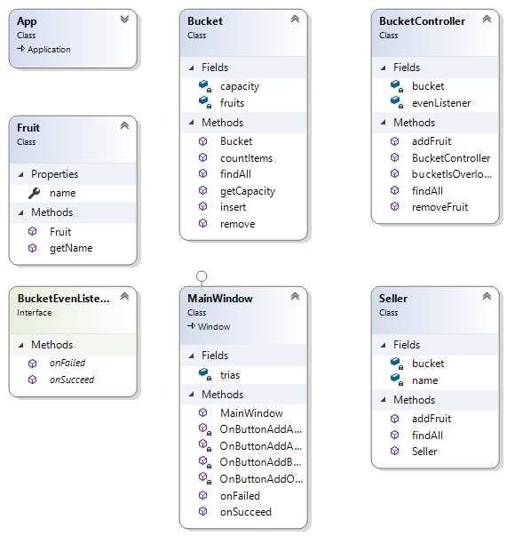

## FreshFruit
Aplikasi ini digunakan untuk menyesuaikan banyaknya jumlah buah dalam keranjang, apabila keranjang belum penuh  maka akan berhasil ditmbahkan dan bila keranjang penuh tidak bisa ditambahkan,

## Scope & Functionalities
- Button dapat diklik
- Jika button add maka keranjang buah akan terisi
- Jika keranjang penuh maka tidak dapat menambahkan dan akan tampil pemberitahuan

## Tugas
1. Fungsi BucketEventListener
    Digunakan untuk menangani keranjang buah,jika keranjang buah belum penuh maka bisa ditambahkan, jika keranjang buah penuh maka tidak bisa ditambahkan dan mendapat pemberitahuan
2. Class Diagram

3. Alur Program
Pada MainWindow.xaml.cs terdapat kode seperti dibawah untuk untuk menambahkan data ke ``BucketController``

 
        private void OnButtonAddAnggurClicked(object sender, RoutedEventArgs e)
        {
            Fruit anggur = new Fruit("Anggur");
            trias.addFruit(anggur);
            ListBoxBucket.Items.Refresh();

        }

Pada kode dibawah digunakan untuk menampilkan warning ketika filed dan akan merefresh yang didalam keranjang  ketika berhasil 

        public void onFailed(string message)
        {
            MessageBox.Show(message, "Warning");
        }

        public void onSucceed(string message)
        {
            ListBoxBucket.Items.Refresh();
        }

Pada ``Seller.cs`` Terdapat kode untuk mengambil sebuah data dari ``
bucketController``
       

        public List<Fruit> findAll()
        {
            return this.bucket.findAll();
        }

Terdapat kode untuk menambah sebuah data ke ``
bucketController``

        public void addFruit(Fruit fruit)
        {
            this.bucket.addFruit(fruit);
        }
Pada ``BucketController.cs`` Terdapat kode untuk menambahkan data ke dalam keranjang/listbox
        

        public void addFruit(Fruit fruit)
        {
            if (bucketIsOverload())
            {
                evenListener.onFailed("Ops,Keranjang penuh");
            }
            else
            {
                this.bucket.insert(fruit);
                evenListener.onSucceed("Yeay, berhasil ditambahkan");
            }
Sebelum dilakukan penambahan ke lisbox maka  terlebih dahulu dicek apakah overload atau tidak
 
        public bool bucketIsOverload()
        {
            return bucket.countItems() >= bucket.getCapacity();
        }
Untuk menangani event maka terdapat  function dibawah ini pada ``Bucket.cs``